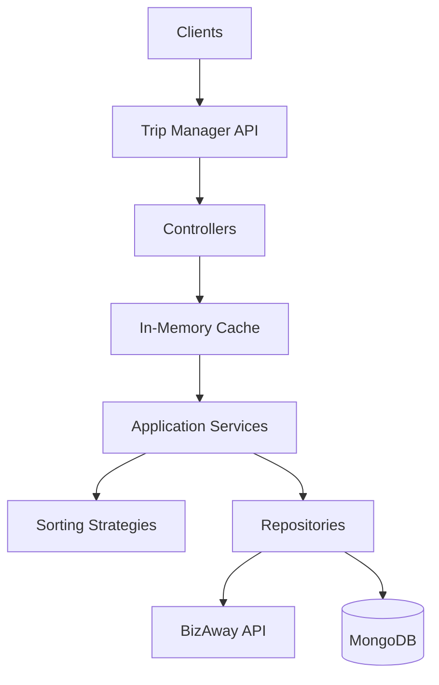

# BizAway Tech Challenge - Trip Management API

**Created by Alirio Angel for the BizAway Challenge**

---

## 📋 Overview

This is an enterprise-grade Trip Management API built with NestJS, designed to help users search for trips from multiple sources and save their favorites. The API follows **Clean Architecture** principles, implements comprehensive security features, and provides robust observability and error handling.

### 🎯 Key Features

- **🔍 Trip Search**: Search trips across multiple transport types with intelligent sorting strategies
  - Sort by cheapest price
  - Sort by fastest duration
  - Multiple transport types (train, car, flight)
  - **⚡ In-Memory Caching**: High-performance caching for frequent searches

- **💾 Trip Manager**: Save and manage favorite trips with session-based tracking
  - Anonymous user support via session IDs
  - Full CRUD operations (Create, Read, Delete)
  - Session persistence across requests

- **🔒 Security**: Production-ready security features
  - Helmet security headers (CSP, HSTS, X-Frame-Options)
  - CORS protection with configurable origins
  - Rate limiting (100 req/min per IP, configurable)

- **🏥 Health Monitoring**: Comprehensive health checks
  - Liveness probe (`/health/live`)
  - Readiness probe with dependency checks
  - Detailed health with MongoDB, memory, disk, and external API status

- **📊 Observability**: Full request tracing and logging
  - Distributed tracing with unique request IDs
  - Structured logging with Winston
  - Request/response metadata tracking

- **🛡️ Error Handling**: Standardized error responses
  - Global exception filter
  - Consistent error format across all endpoints
  - Detailed error logging with trace IDs

- **📝 API Documentation**: Interactive Swagger/OpenAPI
  - Complete endpoint documentation
  - Request/response examples
  - Try-it-out functionality

---

## 🏗️ Architecture

This project follows **Clean Architecture** (Hexagonal Architecture) principles:



### Directory Structure

```
src/
├── shared/                 # Cross-cutting concerns
│   ├── filters/           # Global exception filter
│   ├── interceptors/      # Response standardization
│   ├── middlewares/       # Request tracing
│   └── validators/        # Custom validation rules
│
├── trips/                 # Trip Search Module
│   ├── domain/           # Entities & repository interfaces
│   ├── application/      # Services, DTOs, controllers
│   └── infrastructure/   # Repository implementations, API clients
│
├── saved-trips/          # Trip Manager Module
│   ├── domain/          # Entities & repository interfaces
│   ├── application/     # Services, DTOs, controllers
│   └── infrastructure/  # MongoDB repository implementations
│
└── health/              # Health Check Module
    └── indicators/      # Custom health indicators
```

### Design Principles

- **Separation of Concerns**: Each layer has distinct responsibilities
- **Dependency Inversion**: Domain layer doesn't depend on infrastructure
- **Repository Pattern**: Abstract data access behind interfaces
- **Strategy Pattern**: Pluggable sorting strategies for trip search
- **DTOs & Validation**: Request/response validation with class-validator


---

## 🚀 Quick Start

### Prerequisites

- **Node.js**: v18 or higher
- **pnpm**: v9 or higher (enforced by package.json)
- **MongoDB**: Optional (defaults to in-memory for local dev)

### Installation Options

#### Option A: Docker Compose (Recommended)
Orchestrates the entire stack including a persistent MongoDB instance.
```bash
docker-compose up -d
```

#### Option B: Local Development (In-Memory DB)
Simplest for quick testing. No database installation required.
```bash
pnpm install
pnpm run start:dev
```

#### Option C: DevContainer (VSCode)
Open this folder in VSCode and click "Reopen in Container" when prompted.

### Configuration

Copy `.env.example` to `.env` and configure:

| Variable | Required | Default | Description |
|----------|----------|---------|-------------|
| `PORT` | No | `3000` | Server port |
| `TRIPS_API_KEY` | **Yes** | - | BizAway API key |
| `TRIPS_API_BASE_URL` | **Yes** | - | BizAway API base URL |
| `MONGODB_URI` | No | `mongodb://localhost:27017/trip-planner` | Connection string |
| `USE_IN_MEMORY_DB` | No | `true` | Set `false` for real MongoDB |
| `CORS_ORIGINS` | No | `*` | Allowed origins |
| `RATE_LIMIT_TTL` | No | `60` | Limit window (seconds) |
| `RATE_LIMIT_MAX` | No | `100` | Requests per window |

4. **Start the application**
   ```bash
   # Development mode (with hot reload)
   pnpm run start:dev
   
   # Production mode
   pnpm run build
   pnpm run start:prod
   ```

5. **Access the API**
   - API Base: `http://localhost:3000`
   - Swagger Docs: `http://localhost:3000/api`

---

## 📚 API Documentation

### Trip Search

**Search for trips between two locations**

```bash
GET /trips?origin={IATA_CODE}&destination={IATA_CODE}&sort_by={cheapest|fastest}
```

**Example:**
```bash
curl "http://localhost:3000/trips?origin=SYD&destination=GRU&sort_by=cheapest"
```

**Response:**
```json
{
  "statusCode": 200,
  "data": [
    {
      "origin": "SYD",
      "destination": "GRU",
      "cost": 950,
      "duration": 30,
      "type": "train",
      "id": "trip-001",
      "display_name": "Economy Train Service"
    }
  ],
  "meta": {
    "traceId": "550e8400-e29b-41d4-a716-446655440000",
    "timestamp": "2026-02-14T18:00:00.000Z",
    "path": "/trips"
  }
}
```

### Saved Trips (Trip Manager)

**Save a trip (creates session if not provided)**
```bash
POST /saved-trips
Content-Type: application/json
x-session-id: {optional-session-id}

{
  "tripId": "trip-001",
  "origin": "SYD",
  "destination": "GRU",
  "cost": 950,
  "duration": 30,
  "type": "train",
  "displayName": "Economy Train Service"
}
```

**Get all saved trips for a session**
```bash
GET /saved-trips
x-session-id: {session-id}
```

**Delete a saved trip**
```bash
DELETE /saved-trips/{trip-id}
x-session-id: {session-id}
```

### Health Checks

```bash
# Is the application running?
GET /health/live

# Is the application ready to serve traffic?
GET /health/ready

# Detailed health status (MongoDB, memory, disk, external API)
GET /health/detailed
```

**For complete API documentation with examples, visit:** `http://localhost:3000/api`

---

## 🧪 Testing

### Run Tests

```bash
# Run all unit tests
pnpm run test

# Run tests in watch mode
pnpm run test:watch

# Run tests with coverage
pnpm run test:cov

# Run E2E tests
pnpm run test:e2e
```

### Postman Collection

A comprehensive Postman collection with automated tests is included:

```bash
📁 postman/
  ├── Tech-Challenge-Collection.json  # Complete API test suite
  └── README.md                       # Collection documentation
```

**Import the collection into Postman and run:**
1. Health Checks (Liveness, Detailed)
2. Trip Search (with validation)
3. Complete Trip Manager flow:
   - Save trip (new session)
   - Save another trip (same session)
   - Get all saved trips
   - Delete a trip
   - Verify deletion

**All requests include automated tests that validate:**
- Response status codes
- Response structure (standardized format)
- Data integrity
- Session management
- Error handling

---

## 🐳 Docker Deployment

### Using Docker Compose (Recommended)

```bash
# Start all services (app + MongoDB)
docker-compose up -d

# View logs
docker-compose logs -f

# Stop services
docker-compose down
```

### Using Dockerfile Only

```bash
# Build image
docker build -t trip-manager-api .

# Run container
docker run -p 3000:3000 \
  -e TRIPS_API_KEY=your_key \
  -e TRIPS_API_BASE_URL=https://api.example.com \
  trip-manager-api
```

---

## 🔧 Development

### Code Quality

```bash
# Lint code
pnpm run lint

# Lint without auto-fix
pnpm run lint:check

# Format code with Prettier
pnpm run format
```

### Git Hooks

The project uses **Husky** for Git hooks:
- **Pre-commit**: Runs lint-staged (ESLint + Prettier on staged files)
- Ensures code quality before commits

---

## 📖 Project Structure

```
.
├── src/
│   ├── main.ts                      # Application entry point
│   ├── app.module.ts               # Root module
│   │
│   ├── shared/                     # Shared utilities
│   │   ├── filters/               # Global exception filter
│   │   ├── interceptors/          # Response interceptor
│   │   ├── middlewares/           # Trace middleware
│   │   └── validators/            # Custom validators
│   │
│   ├── trips/                     # Trip Search feature
│   │   ├── domain/
│   │   ├── application/
│   │   └── infrastructure/
│   │
│   ├── saved-trips/              # Trip Manager feature
│   │   ├── domain/
│   │   ├── application/
│   │   └── infrastructure/
│   │
│   └── health/                   # Health checks
│       ├── health.controller.ts
│       └── indicators/
│
├── test/                         # E2E tests
├── postman/                      # Postman collection
├── .env.example                  # Environment template
├── docker-compose.yml           # Docker orchestration
├── Dockerfile                   # Container definition
└── README.md                    # This file
```

---

## 🤔 Design Decisions & Trade-offs

This project was built to demonstrate **Senior Engineering** practices, prioritizing maintainability, scalability, and robustness over simple "it works" solutions.

### 1. Robust Architecture (Clean/Hexagonal)
- **Decision**: Implement full clean architecture with strict boundary separation.
- **Why**: Even for a small challenge, this demonstrates how to structure large-scale applications where business logic must remain independent of frameworks and external APIs.

### 2. Testing Strategy
- **Coverage**: ~22% (Statements)
- **Focus**: The testing strategy strictly focuses on **Domain Logic** (Strategies, Validators) and **Business Rules**, intentionally avoiding brittle tests on framework boilerplate (Modules, simple pass-through Controllers).
- **Goal**: High-value tests that catch regressions in complex logic, rather than inflating coverage numbers with low-value boilerplate tests.

### 3. Caching Strategy
- **Decision**: In-memory caching using NestJS `CacheModule`.
- **Trade-off**: While Redis would be the production standard for distributed systems, an in-memory solution was chosen to simplify the assessment review process (zero external infrastructure dependencies required).
- **Impact**: Drastically reduces latency for repeated search queries while keeping the setup lightweight.

### 4. Resiliencia & Circuit Breaker (Future)
- **Status**: Not implemented in v1.
- **Plan**: In a production environment, calls to the external `TRIPS_API` would be wrapped in a Circuit Breaker (e.g., `opossum`) to fail fast and prevent cascading failures during provider outages.

### 5. In-Memory Database
- **Decision**: Default to `mongodb-memory-server`.
- **Reasoning**: Ensures the project "just works" immediately after `npm install`, avoiding "works on my machine" issues related to local database versions or Docker networking.

---

## 🎯 Evaluation Criteria Coverage

### ✅ Functionality
- Complete implementation of all required features
- Trip search with multiple sorting strategies
- Full CRUD for saved trips
- Session management for anonymous users
- Health checks and monitoring

### ✅ Code Quality
- Clean Architecture (Hexagonal Architecture)
- SOLID principles applied
- TypeScript with strict typing
- ESLint + Prettier for code consistency
- Husky pre-commit hooks
- Comprehensive error handling

### ✅ Documentation
- Detailed README with all setup instructions
- Inline code documentation
- Swagger/OpenAPI interactive documentation

- Postman collection with usage examples

### ✅ Testing
- Unit tests for critical components (DTOs, services, strategies)
- Postman collection with 12+ automated tests
- E2E test structure included
- Error scenarios covered
- Test coverage reporting

### ✅ Creativity & Beyond Requirements
- **Distributed Tracing**: Unique request IDs across all logs
- **Standardized Responses**: Consistent response format with metadata
- **Strategy Pattern**: Extensible sorting implementation
- **Health Indicators**: Custom health checks for MongoDB and external API
- **Docker Support**: Complete containerization with docker-compose
- **In-Memory DB**: Zero-config local development
- **Rate Limiting**: DDoS protection
- **Security Headers**: Production-ready security with Helmet

---

## 🤝 Support & Contact

**Author**: Alirio Angel  
**Challenge**: BizAway Technical Assessment  
**Date**: February 2026

For questions or issues, please open an issue in the repository or contact via email.

---

## 📄 License

UNLICENSED - Created for BizAway Technical Challenge
